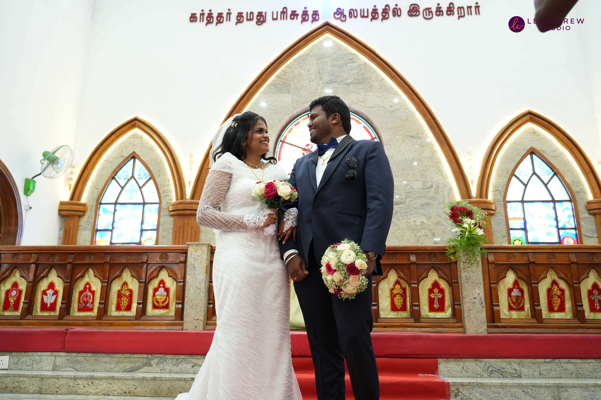

<!DOCTYPE html>
<html>
<head>
<title>NITHIN weds STELLA</title>
<meta charset="UTF-8">
<meta name="viewport" content="width=device-width, initial-scale=1">
<link rel="stylesheet" href="https://www.w3schools.com/w3css/4/w3.css">
<link rel="stylesheet" href="https://fonts.googleapis.com/css?family=Raleway">

</head>
<body>

<!-- Header / Home-->
<header class="w3-display-container w3-wide bgimg w3-grayscale-min" id="home">
  

    <h1 class="w3-jumbo" style="color: #FFC0CB">Stella & Nithin</h1>  
    <h2 style="color: black;">Wedding Reception</h2>
    <h2 style="color: black;"><b>22.06.2024</b></h2>
  

</header>

<!-- Navbar (sticky bottom) -->

  

    <a href="#home" style="width:25%" class="w3-bar-item w3-button">Home</a>
    <a href="#us" style="width:25%" class="w3-bar-item w3-button">Stella & Nithin</a>
    <a href="#wedding" style="width:25%" class="w3-bar-item w3-button">Wedding</a>
    <a href="#rsvp" style="width:25%" class="w3-bar-item w3-button w3-hover-black">RSVP</a>
  

<!-- About / Jane And John -->

  

    <h1 class="w3-center w3-text-grey"><b>Stella & Nithin</b></h1>
    
<i>You all know us. And we all know you.  
      Celebrate love, laughter, and breathtaking scenery with Stella and Nithin!  
      Join us for an outdoor wedding ceremony followed by heartfelt prayers, joyful greetings, and a delicious lunch prepared by a renowned chef.  Kids will love exploring the park while you take in the beauty and celebrate with the happy couple.</i>
    
 
    
<a href="#wedding" class="w3-button w3-black w3-round w3-padding-large w3-large">Reception Details</a>

  

<!-- Background photo -->

  

    <h1 class="w3-jumbo" style="color: whitesmoke;">You Are Invited</h1> 
    <h2 style="color: whitesmoke;">Of course..</h2>
  

<!-- Wedding information -->

  

    <h1 class="w3-text-grey"><b>THE WEDDING RECEPTION</b></h1>
    
    

      

        <h2>When</h2>
        
Saturday, 22 June 2024 - 11:30am

        
Followed by lunch - 1:00pm

      

      

        <h2>Where</h2>
        
<a href="https://maps.app.goo.gl/7Esfwe6oEcix7VfFA">The Salvation Army</a>

        
<a href="https://maps.app.goo.gl/7Esfwe6oEcix7VfFA">Orange Grove Road, Coonoor</a>

      

    

  

<!-- RSVP section -->

  <h1>HOPE YOU CAN MAKE IT!</h1>
  
Kindly Respond By June 21, 2024

  

    <button onclick="document.getElementById('id01').style.display='block'" class="w3-button w3-round w3-red w3-opacity w3-hover-opacity-off" style="padding:8px 60px">RSVP</button>
  

  

    

      <h3 class="w3-wide">Tennyson Paul and Family</h1>
      
We really hope you can make it.

      
 PRADIV : +(91) 9944672077

      
 TENNYSON : +(91) 7010912841

        
<i>Sincerely,  Stella & Nithin</i>

        

          

            <button onclick="submitRSVP()" type="button" class="w3-button w3-block w3-green">Going</button>
          

          

            <button onclick="document.getElementById('id01').style.display='none'" type="button" class="w3-button w3-block w3-red">Close</button>
          

        

      </form>
      
Thank you for your RSVP! We look forward to celebrating with you.

    

  

<!-- Footer -->
<footer class="w3-center w3-black w3-padding-16">
  
Developed and Hosted By <a href="https://www.controlshiftcareer.com" title="W3.CSS" target="_blank" class="w3-hover-text-green">ControlShiftCareer</a>

  
Photography By <a href="www.lenscrewstudio.co.in" title="W3.CSS" target="_blank" class="w3-hover-text-green">Lens Crew Studio</a>

</footer>

 

</body>

</html>
